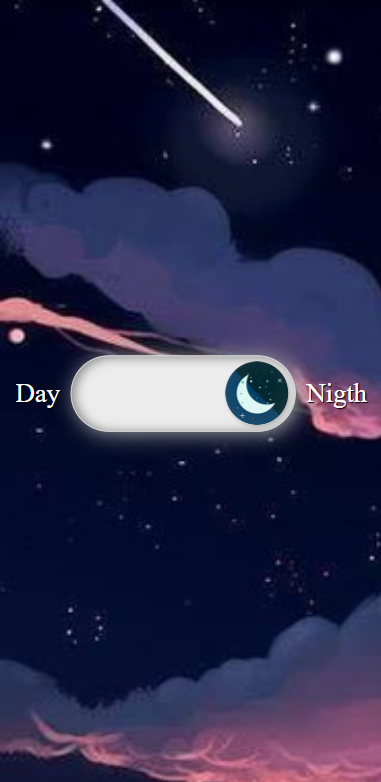

<div align="center"> 
<h1>Challenge 3</h1>
<p>Create a button animated</p>
</div>

<p> I created two different projects the first one just below are buttons with different hover effects
and the second is a day and night button that changes the background by clickinge</p>

&nbsp;

<div>
<strong>Buttons with different hover effects</strong>


&nbsp;

<strong>Input day nigth</strong>

<div align="center">


</div>

</div>

&nbsp;

## Stacks

<div style="display: inline_block">


</div>

&nbsp;

## Install

To install this application on your local machine just follow the steps below
On the main page of the project you click on clone (green button) and copy the https of the project

Then in your terminal you type the following commands.

```bash
 $ git clone https://github.com/AnnaRe1s/Challenge21days.git
 $ cd challenge21days
 $ cd day_two
 $ code .
```

So it will open the project on your machine.\
Navigate to the file you want to open, in file named index.HTML and right click and click **open with live share**

&nbsp;

<div align="center">

### Autor

---

 
 <br />
 <sub><b>Anna Reis</b></sub>

Created with ❤️ by Anna Reis.

#### Contact

[](https://www.linkedin.com/in/anna-beatriz-reis/)

 </div>
