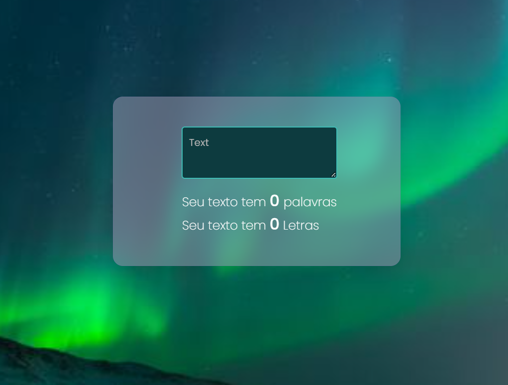

<div align="center"> <h1> Contador / Glassmorphism </h1></div>

Challenge six was to create a glassmorphism which is an attempt to simulate a film of glass in the application, and challenge 7 was to create a counter.

I created a word and letter counter, in this counter's container I applied glassmorphism.



&nbsp;

## Stacks

<div style="display: inline_block">


</div>

&nbsp;

## Install

To install this application on your local machine just follow the steps below
On the main page of the project you click on clone (green button) and copy the https of the project

Then in your terminal you type the following commands.

```bash
 $ git clone https://github.com/AnnaRe1s/Challenge21days.git
 $ cd challenge21days
 $ cd contador
 $ code .
```

So it will open the project on your machine.

```bash
 $ npm install
 $ npm start
```

> If you don't open the project, just go to your browser and type http://localhost:3000
