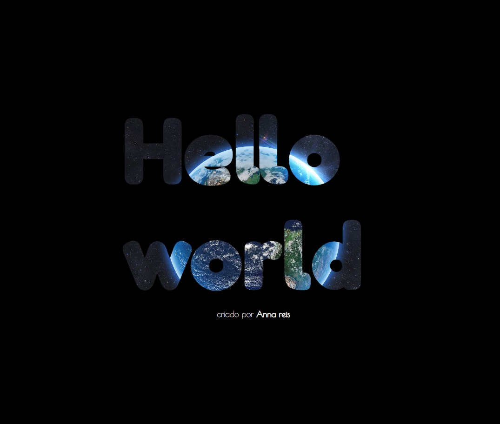

<h1 align="center"> Challenge 2</h1>

<p>In this challenge it was to create a different "hello world". </p>
<p>I created the text hello world where the background is an image of the world </p>



&nbsp;

## Stacks

<div style="display: inline_block">


</div>

&nbsp;

## Install

To install this application on your local machine just follow the steps below
On the main page of the project you click on clone (green button) and copy the https of the project

Then in your terminal you type the following commands.

```bash
 $ git clone https://github.com/AnnaRe1s/Challenge21days.git
 $ cd challenge21days
 $ cd day_one
 $ code .
```

So it will open the project on your machine.\
Navigate to index.html and right click and click **open with live share**

&nbsp;

### Autor

---

 
 <sub><b>Anna Reis</b></sub>
 
Created with ❤️ by Anna Reis.

#### Contact
[](https://www.linkedin.com/in/anna-beatriz-reis/)


